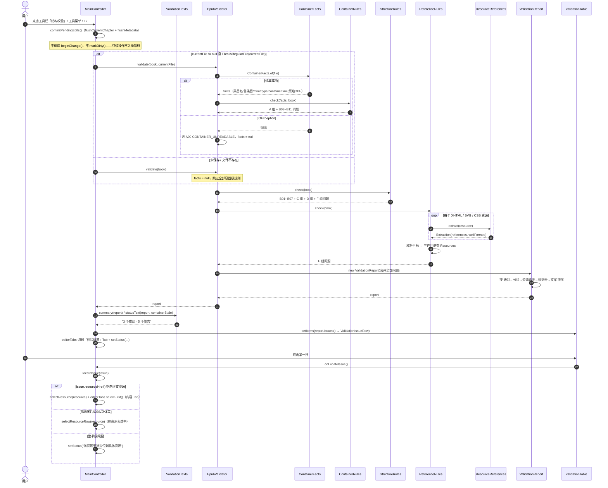
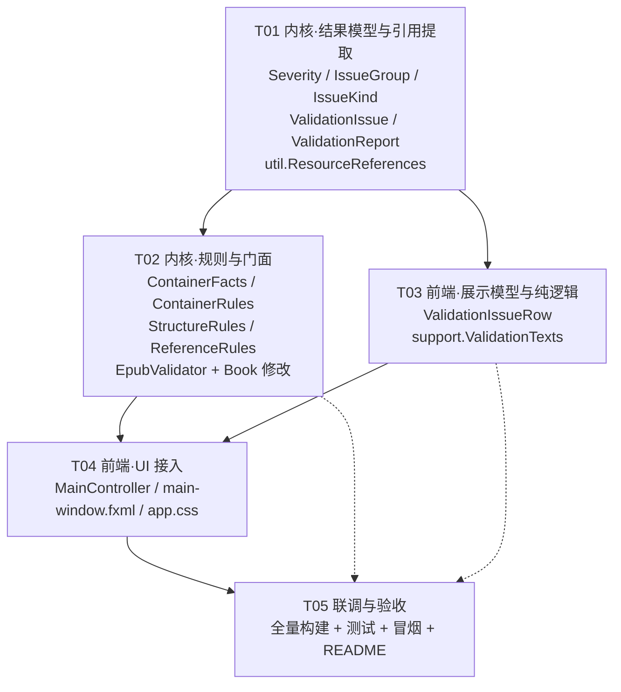

# Epubra 增量系统设计：EPUB 结构校验

> 版本：v1（增量） ｜ 架构师：高见远 ｜ 基线：`com.epubra:epubra-parent:1.0.0-SNAPSHOT`
> 本文基于对现有源码的逐文件通读编写，所有引用的类名 / 方法签名均来自实际代码。

---

## 1. 实现方案

### 1.1 现状与约束分析

通读代码后，对设计影响最大的几条既有事实：

| 事实 | 出处 | 对设计的影响 |
|---|---|---|
| `Resources` 用 `LinkedHashMap` 按 `href` 与 `id` **双索引** | `Resources.add()` | manifest 里重复的 `id` / `href` 在读入时就被覆盖，**内存模型中不可见** → 这两条规则只能靠「直接解析容器里的原始 OPF」实现 |
| `EpubReader.readManifest()` 在条目缺失时只打日志，仍创建资源且 `data = new byte[0]` | `EpubReader:158-162` | 「条目在 ZIP 中不存在」在内存里退化为「资源内容为空」→ 两个入口要给出**互斥**的两条规则 |
| `Book.version()` 由 `EpubVersion.fromSpecVersion(attr)` 得到，缺属性时静默回退 `EPUB_2` | `EpubReader:48` | 「OPF 未声明 version」内存检测不到 → 归入容器级规则 |
| `Resource.isNavDocument()` 是 `properties.contains("nav")` **子串匹配** | `Resource:76` | `properties="navigation"` 会误判 → 校验里判定 nav 必须按空白拆分后全等比较，不能复用该方法 |
| `Book.unreferencedResources()` 用「把全部正文拼成一个字符串再 `contains(fileName)`」 | `Book:211-248` | 误判（正文里提到文件名就算引用）、漏判（CSS 里 `url()` 引用的字体被算成孤儿）→ 需要精确的引用提取 |
| `EpubWriter.write(Book, OutputStream)` 能把 Book 序列化成完整 EPUB 字节 | `BookHistory.serialize()` 已在用 | 可参考，但容器级校验**不能**用它（见 1.4） |
| `Book.source()` / `MainController.currentFile` 指向最近一次打开或保存的文件 | `Book:78`、`MainController:124` | mimetype 校验必须走这个路径，才能校验「外来 EPUB」 |

### 1.2 分层

```
┌───────────────────────────────────────────────────────────────┐
│ epubra-app（JavaFX）                                            │
│   controller/MainController   只做：触发校验、把结果塞进 TableView │
│   controller/ValidationIssueRow  行视图模型（Bean 属性）          │
│   support/ValidationTexts     纯逻辑：中文标签 / 摘要 / 过滤 ★可测 │
└───────────────────────────┬───────────────────────────────────┘
                            │ 只依赖 com.epubra.epublib.validation 的公开 API
┌───────────────────────────▼───────────────────────────────────┐
│ epubra-epublib :: com.epubra.epublib.validation（新增包）        │
│   EpubValidator            门面：装配规则 → 排序 → 报告            │
│   ContainerRules           A 组 + 容器增强（mimetype/原始 OPF）    │
│   StructureRules           B/C/D/F 组（OPF、spine、目录、元数据）  │
│   ReferenceRules           E 组（引用完整性、孤儿资源）             │
│   ContainerFacts           从 ZIP 读出的事实（不做判定）            │
│   Severity / IssueGroup / IssueKind / ValidationIssue / Report   │
└───────────────────────────┬───────────────────────────────────┘
                            │
┌───────────────────────────▼───────────────────────────────────┐
│ epubra-epublib :: util.ResourceReferences（新增，util 层）        │
│   为什么放 util 而不是 validation：domain.Book 也要用它改          │
│   unreferencedResources()，放 validation 会造成 domain 反向依赖    │
└───────────────────────────────────────────────────────────────┘
```

**为什么引用提取必须落在 `util`**：需求要求「孤儿资源」既要被校验器报告，也要和既有的「清理未引用资源」动作口径一致。让 `Book.unreferencedResources()` 与 `ReferenceRules` 共用 `ResourceReferences`，才能保证「校验说有 3 个孤儿」和「点清理删掉 3 个」永远一致。

### 1.3 核心类职责

- **`IssueKind`**：全部校验项的**唯一枚举源**。每条带 `code`（如 `A01`）、`group`、`defaultSeverity`、`template`（中文说明）。新增规则 = 加一个枚举常量 + 一个判定分支，规则清单与代码一一对应，不会出现「文档里有、代码里没有」。
- **`ValidationIssue`**：不可变 record。`resourceHref` 为 `null` 表示整书级 / 容器级问题（无法定位到资源）。
- **`ValidationReport`**：**构造时即排序并 `List.copyOf`**，保证任何入口拿到的顺序都一致；额外持有 `containerChecked` 标志。
- **`ContainerFacts`**：纯「事实采集」，不产出任何问题。读 ZIP 物理首条目名、mimetype 内容/压缩方式、container.xml 的 `full-path`、原始 OPF 的 manifest 明细。这样 `ContainerRules` 只做判定，单测里可以手搓 facts 而不必造真实 ZIP。
- **`EpubValidator`**：两个入口。`validate(Book)` 纯内存；`validate(Book, Path)` 追加容器规则。

### 1.4 关于 mimetype 校验的关键取舍

`mimetype` 校验（内容 / STORE / 归档首位）只有在**读真实磁盘文件**时才有意义：

- 若像 `BookHistory` 那样先把内存 `Book` 用 `EpubWriter` 序列化到临时文件再校验，那 mimetype 永远是 `EpubWriter` 自己写的、必然通过 —— 校验对象变成了我们自己的写出器，失去「发现外来 EPUB 不合规」的价值。
- 因此：**容器级规则一律读 `currentFile`（磁盘上的真实文件）**。代价是：如果用户有未保存的修改，容器级结果可能滞后。处理方式见 §8 共享知识第 7 条与 §9 风险点 3 —— 由控制器在状态栏给出一句提示，不做静默误报。

### 1.5 与撤销/重做的关系（明确说明）

**本轮校验是纯只读操作，不产生新的历史记录。** 具体约定：

- 校验前**只调用** `commitPendingEdits()`（把编辑器里用户已经看到的文本/元数据同步进 `Book`），**不调用 `beginChange()`**、**不调用 `markDirty()`**。
  - 理由：`commitPendingEdits()` 不记录快照、不改 `dirty`，与既有 `onRefreshPreview()` / `saveTo()` 的处理一致；它只是把「用户已经在屏幕上看到的状态」倒进内存模型，不构成一次用户可感知的编辑步骤。
  - `beginChange()` 会给撤销栈压一个快照，用户点一次「校验」再按 Ctrl+Z 会发现什么都没变却消耗了一步撤销 —— 这是必须避免的。
- 校验器内部**禁止**修改任何 `Resource.data()`（`Resource.data()` 直接返回内部数组，没有防御性拷贝）。

---

## 2. 文件清单

### 2.1 新增 — `epubra-epublib`

| # | 相对路径 | 职责 |
|---|---|---|
| 1 | `epubra-epublib/src/main/java/com/epubra/epublib/validation/Severity.java` | 严重级别枚举 `ERROR` / `WARNING`，含 `label()` 返回「错误」/「警告」 |
| 2 | `epubra-epublib/src/main/java/com/epubra/epublib/validation/IssueGroup.java` | 规则分组枚举（容器/OPF/阅读顺序/目录/资源引用/元数据），决定排序段位与界面「分类」列 |
| 3 | `epubra-epublib/src/main/java/com/epubra/epublib/validation/IssueKind.java` | **全部校验项枚举**：`code` + `group` + 默认 `severity` + 中文说明模板（本轮的规则总表就落在这个文件里） |
| 4 | `epubra-epublib/src/main/java/com/epubra/epublib/validation/ValidationIssue.java` | 单条校验结果 record：`kind` / `severity` / `message` / `resourceHref` / `detail` |
| 5 | `epubra-epublib/src/main/java/com/epubra/epublib/validation/ValidationReport.java` | 结果集：构造即排序、错误/警告计数与分拣、`isEmpty()`、`containerChecked()`、`summary()`；提供 `EMPTY` 常量 |
| 6 | `epubra-epublib/src/main/java/com/epubra/epublib/validation/ContainerFacts.java` | 从 ZIP 采集的事实：条目名集合、物理首条目名、mimetype 是否存在/是否 STORED/内容、container.xml 的 `full-path`、原始 OPF 的 `version`/`unique-identifier`/manifest 明细 |
| 7 | `epubra-epublib/src/main/java/com/epubra/epublib/validation/ContainerRules.java` | A 组（mimetype / container.xml）+ 容器增强规则（原始 OPF 重复 id/href、version、清单条目是否在 ZIP） |
| 8 | `epubra-epublib/src/main/java/com/epubra/epublib/validation/StructureRules.java` | B 组（OPF/manifest 自身）+ C 组（spine ↔ manifest）+ D 组（Nav/NCX/TOC/封面一致性）+ F 组（元数据） |
| 9 | `epubra-epublib/src/main/java/com/epubra/epublib/validation/ReferenceRules.java` | E 组：正文/CSS/SVG 引用解析、断链、越界、锚点缺失、孤儿资源 |
| 10 | `epubra-epublib/src/main/java/com/epubra/epublib/validation/EpubValidator.java` | 门面：`validate(Book)`、`validate(Book, Path)`；装配三组规则 → 合并 → 排序 → 出报告 |
| 11 | `epubra-epublib/src/main/java/com/epubra/epublib/util/ResourceReferences.java` | 引用提取工具：DOM 解析提取 URI 引用，解析失败正则回退；`resolveTarget` / `isExternal` / `percentDecode` / `urlReferences` / `fragmentIds` |
| 12 | `epubra-epublib/src/test/java/com/epubra/epublib/validation/EpubValidatorTest.java` | 内核校验端到端测试（造病态 Book + 造真实 .epub 走容器校验） |
| 13 | `epubra-epublib/src/test/java/com/epubra/epublib/util/ResourceReferencesTest.java` | 引用提取测试（img/link/a/svg use/inline style/CSS url/@import/百分号编码/外部链接） |

### 2.2 修改 — `epubra-epublib`

| # | 相对路径 | 改动 |
|---|---|---|
| 14 | `epubra-epublib/src/main/java/com/epubra/epublib/domain/Book.java` | `unreferencedResources()`：把「拼全文 + `contains(fileName)`」替换为「用 `ResourceReferences` 收集全部真实引用 href 集合」再比对。白名单（nav / ncx / 封面 / spine）逻辑保持不变 |

### 2.3 新增 — `epubra-app`

| # | 相对路径 | 职责 |
|---|---|---|
| 15 | `epubra-app/src/main/java/com/epubra/app/controller/ValidationIssueRow.java` | 问题表格行视图模型，Bean 属性 `severity` / `severityKey` / `category` / `message` / `location` 供 `PropertyValueFactory` 取值 |
| 16 | `epubra-app/src/main/java/com/epubra/app/support/ValidationTexts.java` | 与 JavaFX 无关的纯逻辑：级别/分组中文标签映射、报告摘要文案、关键字与「只看错误」过滤 ★可单测 |
| 17 | `epubra-app/src/test/java/com/epubra/app/support/ValidationTextsTest.java` | `ValidationTexts` 单测（沿用 `@DisplayName` + 英文方法名风格） |

### 2.4 修改 — `epubra-app`

| # | 相对路径 | 改动 |
|---|---|---|
| 18 | `epubra-app/src/main/java/com/epubra/app/controller/MainController.java` | 新增 `EpubValidator` 字段与 `lastReport`；新增校验面板的 `@FXML` 控件与 `onValidate()` / `onLocateIssue()` / `showValidationReport()` / `applyValidationFilter()` / `locateIssue()` / `selectResourceRow()` |
| 19 | `epubra-app/src/main/resources/com/epubra/app/view/main-window.fxml` | 新增「工具」菜单 + 工具栏「结构校验」按钮 + `editorTabs` 第 4 个 Tab「校验结果」（摘要行 + 过滤条 + 问题表格） |
| 20 | `epubra-app/src/main/resources/com/epubra/app/css/app.css` | 追加校验结果区样式：错误行红字、警告行橙字、摘要与过滤条 |

> 三个 `pom.xml` **均不需要改动**（内核零依赖、前端只依赖既有模块与 JavaFX）。

---

## 3. 类图与接口定义

> 独立文件：`docs/class-diagram.mermaid`

```mermaid
classDiagram
    direction LR

    class Severity {
        <<enum>>
        ERROR
        WARNING
        +label() String
    }

    class IssueGroup {
        <<enum>>
        CONTAINER
        OPF
        SPINE
        NAVIGATION
        REFERENCE
        METADATA
        +label() String
    }

    class IssueKind {
        <<enum>>
        MIMETYPE_MISSING
        MIMETYPE_NOT_FIRST
        MIMETYPE_NOT_STORED
        MIMETYPE_CONTENT_INVALID
        CONTAINER_XML_MISSING
        CONTAINER_ROOTFILE_INVALID
        CONTAINER_ROOTFILE_MISSING
        OPF_ENTRY_MISSING
        CONTAINER_UNREADABLE
        OPF_PATH_INVALID
        MANIFEST_EMPTY
        MANIFEST_ID_BLANK
        MANIFEST_HREF_BLANK
        MANIFEST_MEDIA_TYPE_BLANK
        MANIFEST_MEDIA_TYPE_MISMATCH
        MANIFEST_ITEM_EMPTY_DATA
        MANIFEST_ITEM_NOT_IN_ZIP
        OPF_DUPLICATE_ID
        OPF_DUPLICATE_HREF
        OPF_VERSION_INVALID
        SPINE_EMPTY
        SPINE_IDREF_UNRESOLVED
        SPINE_IDREF_DUPLICATE
        SPINE_TOC_ID_UNRESOLVED
        SPINE_TOC_NOT_NCX
        SPINE_NON_CONTENT_DOCUMENT
        MANIFEST_DOC_NOT_IN_SPINE
        SPINE_ALL_NON_LINEAR
        SPINE_ORDER_VS_TOC
        TOC_EMPTY
        TOC_TARGET_MISSING
        TOC_TARGET_NOT_IN_SPINE
        TOC_FRAGMENT_MISSING
        TOC_TITLE_BLANK
        NAV_MISSING
        NAV_MULTIPLE
        NAV_NOT_XHTML
        NAV_EMPTY
        NAV_PARSE_FAILED
        NAV_TARGET_MISSING
        NAV_VS_TOC_INCONSISTENT
        NCX_MISSING
        NCX_NOT_REFERENCED
        NCX_PARSE_FAILED
        NCX_TARGET_MISSING
        NCX_VS_TOC_INCONSISTENT
        COVER_ID_UNRESOLVED
        COVER_NOT_IMAGE
        XHTML_NOT_WELL_FORMED
        REFERENCE_TARGET_MISSING
        REFERENCE_TARGET_OUTSIDE
        FRAGMENT_MISSING
        RESOURCE_ORPHAN
        METADATA_TITLE_MISSING
        METADATA_IDENTIFIER_MISSING
        METADATA_LANGUAGE_MISSING
        METADATA_MODIFIED_MISSING
        +code() String
        +group() IssueGroup
        +severity() Severity
        +template() String
    }

    class ValidationIssue {
        <<record>>
        +IssueKind kind
        +Severity severity
        +String message
        +String resourceHref
        +String detail
        +ValidationIssue(IssueKind kind, String message)
        +ValidationIssue(IssueKind kind, String message, String resourceHref)
        +ValidationIssue(IssueKind kind, Severity severity, String message, String resourceHref, String detail)
        +location() String
    }

    class ValidationReport {
        +ValidationReport EMPTY
        -List~ValidationIssue~ issues
        -boolean containerChecked
        +issues() List~ValidationIssue~
        +errors() List~ValidationIssue~
        +warnings() List~ValidationIssue~
        +errorCount() int
        +warningCount() int
        +isEmpty() boolean
        +containerChecked() boolean
        +summary() String
    }

    class ContainerFacts {
        <<record>>
        +Path file
        +Set~String~ entryNames
        +String firstEntryName
        +boolean mimetypePresent
        +boolean mimetypeStored
        +String mimetypeContent
        +boolean containerPresent
        +String rootfileFullPath
        +RawOpf opf
        +of(Path file) ContainerFacts
        +hasEntry(String name) boolean
    }

    class RawOpf {
        <<record>>
        +boolean present
        +boolean parsed
        +String version
        +String uniqueIdentifierId
        +List~ManifestItem~ items
    }

    class ManifestItem {
        <<record>>
        +String id
        +String href
        +String mediaType
    }

    class ContainerRules {
        <<static>>
        +check(ContainerFacts facts, Book book) List~ValidationIssue~
        -checkMimetype(ContainerFacts, List) void
        -checkContainerXml(ContainerFacts, List) void
        -checkRawOpf(ContainerFacts, Book, List) void
        -checkManifestEntriesInZip(ContainerFacts, Book, List) void
    }

    class StructureRules {
        <<static>>
        +check(Book book) List~ValidationIssue~
        -checkOpfBasics(Book, List) void
        -checkSpine(Book, List) void
        -checkToc(Book, List) void
        -checkNav(Book, List) void
        -checkNcx(Book, List) void
        -checkCover(Book, List) void
        -checkMetadata(Book, List) void
    }

    class ReferenceRules {
        <<static>>
        +check(Book book) List~ValidationIssue~
        -checkWellFormed(Book, List) void
        -checkReferences(Book, List) void
        -checkOrphans(Book, List) void
    }

    class EpubValidator {
        +validate(Book book) ValidationReport
        +validate(Book book, Path containerFile) ValidationReport
        -merge(List~ValidationIssue~...) ValidationReport
    }

    class ResourceReferences {
        <<static>>
        +extract(Resource resource) Extraction
        +resolveTarget(String baseDir, String rawTarget) String
        +isExternal(String rawTarget) boolean
        +percentDecode(String text) String
        +urlReferences(String cssText) List~String~
        +fragmentIds(Resource resource) Set~String~
    }

    class Reference {
        <<record>>
        +String sourceHref
        +String context
        +String rawTarget
    }

    class Extraction {
        <<record>>
        +List~Reference~ references
        +boolean wellFormed
    }

    class ValidationTexts {
        <<static>>
        +severityLabel(Severity severity) String
        +groupLabel(IssueGroup group) String
        +summary(ValidationReport report) String
        +statusText(ValidationReport report, boolean containerStale) String
        +filter(List~ValidationIssue~ issues, String keyword, boolean onlyErrors) List~ValidationIssue~
    }

    class ValidationIssueRow {
        -ValidationIssue issue
        +getSeverity() String
        +getSeverityKey() String
        +getCategory() String
        +getMessage() String
        +getLocation() String
        +getIssue() ValidationIssue
    }

    class MainController {
        -EpubValidator validator
        -ValidationReport lastReport
        -TableView~ValidationIssueRow~ validationTable
        +onValidate() void
        +onLocateIssue() void
        -showValidationReport(ValidationReport) void
        -applyValidationFilter() void
        -locateIssue(ValidationIssue) void
        -selectResourceRow(Resource) void
    }

    class Book {
        +resources() Resources
        +spine() Spine
        +toc() TableOfContents
        +metadata() Metadata
        +version() EpubVersion
        +opfPath() String
        +contentDirectory() String
        +coverResourceId() String
        +coverResource() Optional~Resource~
        +navResource() Resource
        +spineResources() List~Resource~
        +unreferencedResources() List~Resource~
    }

    IssueKind --> IssueGroup : group
    IssueKind --> Severity : default severity
    ValidationIssue --> IssueKind : kind
    ValidationIssue --> Severity : severity
    ValidationReport *-- ValidationIssue : 已排序
    ContainerFacts *-- RawOpf : opf
    RawOpf *-- ManifestItem : items
    EpubValidator ..> ContainerFacts : of()
    EpubValidator ..> ContainerRules : check()
    EpubValidator ..> StructureRules : check()
    EpubValidator ..> ReferenceRules : check()
    EpubValidator ..> ValidationReport : 产出
    ContainerRules ..> ValidationIssue : 产出
    StructureRules ..> ValidationIssue : 产出
    ReferenceRules ..> ValidationIssue : 产出
    ContainerRules ..> Book : 只读
    StructureRules ..> Book : 只读
    ReferenceRules ..> Book : 只读
    ReferenceRules ..> ResourceReferences : extract()
    ResourceReferences ..> Extraction : 产出
    Extraction o-- Reference
    Book ..> ResourceReferences : unreferencedResources() 复用
    MainController --> EpubValidator
    MainController --> ValidationReport
    MainController --> ValidationIssueRow
    MainController ..> ValidationTexts
    ValidationIssueRow --> ValidationIssue
    ValidationTexts ..> ValidationReport
```



### 3.1 关键方法签名（可直接落到代码）

```java
package com.epubra.epublib.validation;

public enum Severity {
    ERROR, WARNING;
    public String label();                    // "错误" / "警告"
}

public enum IssueGroup {
    CONTAINER("容器"), OPF("OPF"), SPINE("阅读顺序"),
    NAVIGATION("目录"), REFERENCE("资源引用"), METADATA("元数据");
    public String label();
}

public enum IssueKind {
    // 完整常量见 §4 校验项清单
    MIMETYPE_MISSING("A01", IssueGroup.CONTAINER, Severity.ERROR, "缺少 mimetype 文件"),
    ;
    public String code();
    public IssueGroup group();
    public Severity severity();      // 默认级别，允许逐条覆盖
    public String template();
}

public record ValidationIssue(
        IssueKind kind,
        Severity severity,
        String message,          // 已填充具体值的完整中文描述
        String resourceHref,     // 可定位的资源在容器内的路径；整书级问题为 null
        String detail            // 技术细节（原始目标串、解析后的路径等），用于 tooltip
) {
    public ValidationIssue(IssueKind kind, String message);
    public ValidationIssue(IssueKind kind, String message, String resourceHref);
    public String location();    // resourceHref == null ? "整书" : resourceHref
}

public final class ValidationReport {
    public static final ValidationReport EMPTY;
    public List<ValidationIssue> issues();     // 不可变、已排序
    public List<ValidationIssue> errors();
    public List<ValidationIssue> warnings();
    public int errorCount();
    public int warningCount();
    public boolean isEmpty();
    public boolean containerChecked();
    public String summary();                  // "未发现问题" / "3 个错误 · 5 个警告"
}
```

```java
package com.epubra.epublib.validation;

/** 从 EPUB 容器（ZIP）采集到的事实，不含任何判定。file 无法读取时由调用方降级。 */
public record ContainerFacts(
        Path file,
        Set<String> entryNames,        // ZIP 中全部条目名（含目录条目）
        String firstEntryName,         // 物理第一个条目的名字（读本地文件头得出，非中央目录顺序）
        boolean mimetypePresent,
        boolean mimetypeStored,        // 压缩方式 == ZipEntry.STORED
        String mimetypeContent,        // 去 BOM 后的原文，条目不存在时为 null
        boolean containerPresent,      // META-INF/container.xml 是否存在
        String rootfileFullPath,       // container.xml 中第一个非空 rootfile/@full-path，解析失败为 null
        RawOpf opf                     // 原始 OPF 的解析结果
) {
    public record ManifestItem(String id, String href, String mediaType) {}
    public record RawOpf(boolean present, boolean parsed, String version,
                         String uniqueIdentifierId, List<ManifestItem> items) {}

    /** @throws IOException 文件不存在、不是合法 ZIP，或读取失败 */
    public static ContainerFacts of(Path file) throws IOException;
    public boolean hasEntry(String name);

    /** 读文件前 30 字节的本地文件头，取出第一个条目名；非 ZIP 返回 null。 */
    static String readFirstEntryName(Path file) throws IOException;
}
```

```java
package com.epubra.epublib.util;

/** XHTML / SVG / CSS 中的 URI 引用提取，仅用 JDK（javax.xml + java.util.regex）。 */
public final class ResourceReferences {

    public record Reference(String sourceHref, String context, String rawTarget) {
        // context 形如 "img/@src"、"a/@href"、"style/url()"、"link/@href"
    }

    /** 提取结果：references 为引用列表，wellFormed=false 表示走了正则回退。 */
    public record Extraction(List<Reference> references, boolean wellFormed) {}

    /** 主入口。XHTML/SVG 先走 DOM（Xmls.parse），失败则正则回退且 wellFormed=false；
     *  CSS 走 url(...) / @import 正则；其余媒体类型返回空列表且 wellFormed=true。 */
    public static Extraction extract(Resource resource);

    /** 把原始目标解析为容器内路径。baseDir 为引用所在资源目录（Hrefs.parentDirectory(href)）。
     *  外部引用（http/https/mailto/tel/data/协议相对）返回 null；空串返回 null。 */
    public static String resolveTarget(String baseDir, String rawTarget);

    public static boolean isExternal(String rawTarget);

    /** 只解码 %XX，不做 '+' → 空格 转换（URLDecoder 会把路径里的 + 吃掉）。 */
    public static String percentDecode(String text);

    /** 抽取 CSS 文本中的 url(...) 与 @import 目标。 */
    public static List<String> urlReferences(String cssText);

    /** 文档内全部 id 属性值；解析失败返回空 Set。 */
    public static Set<String> fragmentIds(Resource resource);
}
```

```java
package com.epubra.app.support;

/** 与 JavaFX 控件无关的展示逻辑，便于无 JavaFX 运行时单测。 */
public final class ValidationTexts {
    public static String severityLabel(Severity severity);
    public static String groupLabel(IssueGroup group);
    public static String summary(ValidationReport report);
    /** 状态栏文案；containerStale=true 时追加「容器级结果基于磁盘文件」提示。 */
    public static String statusText(ValidationReport report, boolean containerStale);
    /** keyword 为空/空白时不过滤；匹配 message + location + detail，忽略大小写。 */
    public static List<ValidationIssue> filter(List<ValidationIssue> issues,
                                               String keyword, boolean onlyErrors);
}
```

---

## 4. 校验项清单（本轮核心）

**优先级说明**：`P0` = 本轮必做（覆盖需求 1~5 的直接判定）；`P1` = 强烈建议（同一批代码顺带完成，成本极低）；`P2` = 可选（时间紧张可砍，砍掉不影响主流程）。

**适用范围列**：`内存` = 无磁盘文件也能跑；`容器` = 需要有真实 .epub 文件才跑。

### A 组 · 容器与 mimetype（需求 4）—— 仅容器校验

| ID | 常量 | 级别 | 优先级 | 判定依据 |
|---|---|---|---|---|
| A01 | `MIMETYPE_MISSING` | 错误 | P0 | `!facts.hasEntry("mimetype")` |
| A02 | `MIMETYPE_NOT_FIRST` | 错误 | P0 | `!"mimetype".equals(facts.firstEntryName())`。**读文件前 30 字节的本地文件头**取首条目名，不用 `ZipFile.entries()`（那是中央目录顺序，可能与物理顺序不同） |
| A03 | `MIMETYPE_NOT_STORED` | 错误 | P0 | `facts.mimetypePresent() && !facts.mimetypeStored()`（`ZipEntry.getMethod() != ZipEntry.STORED`） |
| A04 | `MIMETYPE_CONTENT_INVALID` | 错误 | P0 | 去 UTF-8 BOM 后 `trim()`，按 US-ASCII 解码，要求**完全等于** `application/epub+zip`（不允许尾随换行） |
| A05 | `CONTAINER_XML_MISSING` | 错误 | P0 | `!facts.hasEntry("META-INF/container.xml")` |
| A06 | `CONTAINER_ROOTFILE_INVALID` | 错误 | P0 | container.xml 解析失败，或无 `rootfile` 元素，或 `full-path` 为空白 |
| A07 | `CONTAINER_ROOTFILE_MISSING` | 错误 | P0 | `full-path` 指向的条目不在 `entryNames` |
| A08 | `OPF_ENTRY_MISSING` | 错误 | P0 | `book.opfPath()` 不在 `entryNames` |
| A09 | `CONTAINER_UNREADABLE` | 错误 | P0 | `ContainerFacts.of()` 抛 `IOException`（文件不存在 / 非 ZIP / 加密）→ 产出此条后仍继续跑内存规则 |

### B 组 · OPF 与 manifest

| ID | 常量 | 级别 | 优先级 | 范围 | 判定依据 |
|---|---|---|---|---|---|
| B01 | `OPF_PATH_INVALID` | 错误 | P1 | 内存 | `opfPath()` 为 null/空白，或规范化后为空、含 `..` 段、以 `/` 开头 |
| B02 | `MANIFEST_EMPTY` | 错误 | P0 | 内存 | `book.resources().size() == 0` |
| B03 | `MANIFEST_ID_BLANK` | 错误 | P0 | 内存 | `resource.id()` 为 null 或 `isBlank()` |
| B04 | `MANIFEST_HREF_BLANK` | 错误 | P0 | 内存 | `resource.href()` 为 null / 空白 / 以 `/` 结尾（目录） |
| B05 | `MANIFEST_MEDIA_TYPE_BLANK` | 错误 | P0 | 内存 | `resource.mediaType()` 为 null 或空白 |
| B06 | `MANIFEST_MEDIA_TYPE_MISMATCH` | 警告 | P1 | 内存 | `MediaTypes.guessByExtension(href)` 与声明的 mediaType 不一致。**仅对扩展名有明确映射的判定**（`guessByExtension` 返回 `application/octet-stream` 时跳过） |
| B07 | `MANIFEST_ITEM_EMPTY_DATA` | 警告 | P0 | **仅内存校验** | 资源 `data().length == 0` 且 mediaType 不是 `text/*`（XHTML/CSS 允许为空）。与 B08 **互斥** |
| B08 | `MANIFEST_ITEM_NOT_IN_ZIP` | 错误 | P0 | **仅容器校验** | 清单 item 按 `Hrefs.resolve(baseDir, href)` 解析出的容器内路径不在 `entryNames` |
| B09 | `OPF_DUPLICATE_ID` | 错误 | P1 | **仅容器校验** | 原始 OPF 的 `<manifest>/<item>` 中 `id` 出现重复。（内存里被 `Resources.byId` 覆盖，检测不到） |
| B10 | `OPF_DUPLICATE_HREF` | 错误 | P1 | **仅容器校验** | 同上，判定 `href`（按 `Hrefs.resolve(baseDir, href)` 归一化后比较） |
| B11 | `OPF_VERSION_INVALID` | 错误 | P1 | **仅容器校验** | 原始 OPF `<package>@version` 缺失，或不是 `2.0` / `3.0`（含 `1.2` 等 EPUB 2 之前的版本） |

### C 组 · spine ↔ manifest 对应关系（需求 2）

| ID | 常量 | 级别 | 优先级 | 范围 | 判定依据 |
|---|---|---|---|---|---|
| C01 | `SPINE_EMPTY` | 错误 | P0 | 内存 | `book.spine().size() == 0` |
| C02 | `SPINE_IDREF_UNRESOLVED` | 错误 | P0 | 内存 | `book.resources().getById(ref.resourceId()) == null` |
| C03 | `SPINE_IDREF_DUPLICATE` | 警告 | P1 | 内存 | 同一 `resourceId` 在 `spine().references()` 中出现多次 |
| C04 | `SPINE_TOC_ID_UNRESOLVED` | 错误 | P0 | 内存 | `spine().tocResourceId()` 非空白，但 `getById(...)` 为 null |
| C05 | `SPINE_TOC_NOT_NCX` | 警告 | P1 | 内存 | tocResourceId 指向的资源 `mediaType()` 不等于 `MediaTypes.NCX` |
| C06 | `SPINE_NON_CONTENT_DOCUMENT` | 错误 | P0 | 内存 | idref 指向的资源 mediaType 既不是 `MediaTypes.XHTML` 也不是 `MediaTypes.SVG`（EPUB 3 允许 SVG 作为内容文档，其余类型不可入 spine） |
| C07 | `MANIFEST_DOC_NOT_IN_SPINE` | 警告 | P0 | 内存 | XHTML 资源（**排除 nav 文档**）不在任何 spine itemref 中 → 阅读器不会把它当作正文显示 |
| C08 | `SPINE_ALL_NON_LINEAR` | 警告 | P2 | 内存 | 所有 itemref 的 `linear()` 均为 false |
| C09 | `SPINE_ORDER_VS_TOC` | 警告 | P2 | 内存 | 把 `toc().flatten()` 解析为资源 id 序列（去重、首次出现为准）后**只保留同时存在于 spine 的那些**，与 spine 中同集合的 id 顺序不一致 |

### D 组 · 目录一致性：Nav / NCX / TOC / 封面（需求 1）

| ID | 常量 | 级别 | 优先级 | 范围 | 判定依据 |
|---|---|---|---|---|---|
| D01 | `TOC_EMPTY` | 警告 | P0 | 内存 | `book.toc().isEmpty()` |
| D02 | `TOC_TARGET_MISSING` | 错误 | P0 | 内存 | `toc().flatten()` 中某节点 `Hrefs.resolve(book.contentDirectory(), node.resourceHref())` 在 `resources()` 中查不到（三连回退后仍失败，见 §8 第 4 条） |
| D03 | `TOC_TARGET_NOT_IN_SPINE` | 警告 | P1 | 内存 | 目标资源存在但其 id 不在 spine 中 |
| D04 | `TOC_FRAGMENT_MISSING` | 警告 | P1 | 内存 | `node.fragmentId()` 非空白，且目标 XHTML 的 `fragmentIds()` 不含该 id |
| D05 | `TOC_TITLE_BLANK` | 警告 | P2 | 内存 | `node.title()` 空白 |
| D06 | `NAV_MISSING` | 错误 | P0 | 内存 | `book.version() == EpubVersion.EPUB_3` 且 `book.navResource() == null`。（EPUB 2 不要求 nav，此时**不报**） |
| D07 | `NAV_MULTIPLE` | 警告 | P2 | 内存 | 带 nav 属性的资源多于一个 |
| D08 | `NAV_NOT_XHTML` | 错误 | P0 | 内存 | nav 资源的 `mediaType()` 不等于 `MediaTypes.XHTML` |
| D09 | `NAV_EMPTY` | 警告 | P0 | 内存 | nav 文档能解析，但 `nav[epub:type=toc]` 不存在，或其下 `<ol>` 中无 `<li>` |
| D10 | `NAV_PARSE_FAILED` | 错误 | P0 | 内存 | `Xmls.parse(nav.data())` 抛 `EpubException` |
| D11 | `NAV_TARGET_MISSING` | 错误 | P0 | 内存 | nav 文档 `<a href>` 解析后不在 `resources()` 中 |
| D12 | `NAV_VS_TOC_INCONSISTENT` | 警告 | P0 | 内存 | nav 文档解析出的 `<a href>` 序列（解析为容器内路径）与 `toc().flatten()` 的 `resourceHref()` 序列（同样解析）不一致 |
| D13 | `NCX_MISSING` | 警告 | P0 | 内存 | 无 `MediaTypes.NCX` 资源（EPUB 3 里 NCX 可选但对 EPUB 2 阅读器是唯一目录来源） |
| D14 | `NCX_NOT_REFERENCED` | 警告 | P1 | 内存 | 存在 NCX 资源，但 `spine().tocResourceId()` 为空或未指向它 |
| D15 | `NCX_PARSE_FAILED` | 错误 | P0 | 内存 | `Xmls.parse(ncx.data())` 抛 `EpubException` |
| D16 | `NCX_TARGET_MISSING` | 错误 | P0 | 内存 | NCX `navPoint/content/@src` 解析后不在 `resources()` 中 |
| D17 | `NCX_VS_TOC_INCONSISTENT` | 警告 | P0 | 内存 | NCX 的 `content/@src` 序列与 `toc()` 序列不一致（nav 存在且解析成功时，`toc` 来自 nav，此条即发现「NCX 与 nav 不一致」） |
| D18 | `COVER_ID_UNRESOLVED` | 错误 | P0 | 内存 | `book.coverResourceId()` 非空白，但 `getById(...)` 为 null |
| D19 | `COVER_NOT_IMAGE` | 警告 | P1 | 内存 | `book.coverResource()` 存在但 mediaType 不以 `image/` 开头 |

> **nav 属性判定约定**：不使用 `Resource.isNavDocument()`（子串匹配会把 `properties="navigation"` 误判为 nav）。统一用
> `properties != null && Arrays.asList(properties.trim().split("\\s+")).contains("nav")`。

### E 组 · 资源引用完整性（需求 3）

| ID | 常量 | 级别 | 优先级 | 范围 | 判定依据 |
|---|---|---|---|---|---|
| E01 | `XHTML_NOT_WELL_FORMED` | 错误 | P0 | 内存 | XHTML / SVG 资源 `Xmls.parse()` 失败（EPUB 规范要求正文是良构 XML，严格阅读器会直接拒绝）。此时走正则回退继续抽引用 |
| E02 | `REFERENCE_TARGET_MISSING` | 错误 | P0 | 内存 | XHTML / SVG / CSS 中的**本地**引用，解析后按三连回退（原样 → 百分号解码 → 大小写不敏感）在 `resources()` 中仍查不到 |
| E03 | `REFERENCE_TARGET_OUTSIDE` | 错误 | P0 | 内存 | `Hrefs.resolve(baseDir, rawTarget)` 的结果以 `..` 开头（逃出容器根目录） |
| E04 | `FRAGMENT_MISSING` | 警告 | P1 | 内存 | 同文档锚点（`href="#id"`）或跨文档锚点（`x.html#id`）在目标文档中不存在对应 `id` |
| E05 | `RESOURCE_ORPHAN` | 警告 | P0 | 内存 | 资源既不在 spine、不被 TOC/nav/NCX 指向、不被任何 XHTML/CSS/SVG 引用，且不是 nav / NCX / 封面 |

**E02 抽取的属性范围**（`ResourceReferences.extract`）：

| 元素 | 属性 | context 串 |
|---|---|---|
| `img` | `src`、`srcset`（按逗号切分、取每段首个空白前 token） | `img/@src` |
| `a` / `area` | `href` | `a/@href` |
| `link` | `href` | `link/@href` |
| `script` | `src` | `script/@src` |
| `object` | `data` | `object/@data` |
| `source` / `video` / `audio` / `track` / `iframe` / `embed` | `src` | `video/@src` 等 |
| `image` / `use` / `feImage`（SVG） | `xlink:href`、`href` | `svg:image/@xlink:href` |
| 任意元素 | `@style` 内联样式中的 `url(...)` | `style/url()` |
| `<style>` 元素正文 | `url(...)`、`@import` | `style-element/url()` |
| CSS 资源全文 | `url(...)`、`@import "..."` | `css/url()` |

**跳过（不产出问题）**：`http://` `https://` `//host/...` `mailto:` `tel:` `data:` `blob:` 等外部引用；空串；`javascript:`。
这些是合法用法，本轮只在 `detail` 里记录，不报问题。

### F 组 · 元数据

| ID | 常量 | 级别 | 优先级 | 范围 | 判定依据 |
|---|---|---|---|---|---|
| F01 | `METADATA_TITLE_MISSING` | 错误 | P1 | 内存 | `book.metadata().firstTitle()` 为空白 |
| F02 | `METADATA_IDENTIFIER_MISSING` | 错误 | P1 | 内存 | `metadata().primaryIdentifier() == null` 或其 `value()` 空白 |
| F03 | `METADATA_LANGUAGE_MISSING` | 错误 | P1 | 内存 | `metadata().language()` 空白或不匹配 `^[A-Za-z]{2,3}(-[A-Za-z0-9]{2,8})*$` |
| F04 | `METADATA_MODIFIED_MISSING` | 警告 | P2 | 内存 | `version() == EPUB_3` 且 `metadata().property("dcterms:modified")` 为 null 或空白 |

> 说明：`EpubWriter.normalize()` 会在写出时自动补齐标题/标识符/语言，所以 F01~F03 主要针对**外来 EPUB**；Epubra 自己写的书不会触发。

**规则总数**：A 9 + B 11 + C 9 + D 19 + E 5 + F 4 = **57 条**（其中 P0 = 34 条，P1 = 16 条，P2 = 7 条）。

---

## 5. 调用流程

> 独立文件：`docs/sequence-diagram.mermaid`



---

## 6. 任务分解

> 严格按依赖顺序排列。**T01 是本次增量的基础设施层**（结果模型 + 规则总表 + 引用提取），必须先落地，后面三个任务都依赖它。
> 每个任务内部的文件高度内聚，任务之间只依赖 T01，可最大程度并行/串行推进。

### T01 · 内核：结果模型 + 引用提取（基础）— P0

**依赖**：无
**目标**：把「校验结果长什么样」和「怎么把正文里的引用抽出来」两件事固化下来。

| 文件 | 类型 | 做什么 |
|---|---|---|
| `.../epublib/validation/Severity.java` | 新增 | 枚举 + `label()` |
| `.../epublib/validation/IssueGroup.java` | 新增 | 6 个分组 + `label()` |
| `.../epublib/validation/IssueKind.java` | 新增 | 按 §4 清单录入全部 57 个常量（P2 的也可以先录，判定分支留空即可，编译不受影响） |
| `.../epublib/validation/ValidationIssue.java` | 新增 | record + 三个便捷构造器 + `location()` |
| `.../epublib/validation/ValidationReport.java` | 新增 | 排序 Comparator、`List.copyOf`、`errors()/warnings()`、`summary()`、`EMPTY` |
| `.../epublib/util/ResourceReferences.java` | 新增 | DOM 抽取 + 正则回退 + `resolveTarget` / `isExternal` / `percentDecode` / `urlReferences` / `fragmentIds` |
| `.../test/.../util/ResourceReferencesTest.java` | 新增 | 覆盖 img/link/a/svg:use/inline-style/CSS url/@import、百分号编码、外部链接、非良构回退 |

**验收**：`mvn -q -pl epubra-epublib test` 通过；`IssueKind` 常量数与 §4 一致。

---

### T02 · 内核：规则实现与门面 — P0

**依赖**：T01
**目标**：把 §4 的判定逻辑全部实现，暴露两个入口。

| 文件 | 类型 | 做什么 |
|---|---|---|
| `.../epublib/validation/ContainerFacts.java` | 新增 | `of(Path)`：开 `ZipFile` → 收集 `entryNames`；**读文件前 30 字节取物理首条目名**；读 mimetype 内容/方法；解析 container.xml 拿 `full-path`；解析原始 OPF 拿 `version`/`unique-identifier`/`manifest items` |
| `.../epublib/validation/ContainerRules.java` | 新增 | A01~A09 + B08 + B09 + B10 + B11 |
| `.../epublib/validation/StructureRules.java` | 新增 | B01~B07、C01~C09、D01~D19、F01~F04。注意 nav 属性用空白拆分全等判定，**不用** `Resource.isNavDocument()` |
| `.../epublib/validation/ReferenceRules.java` | 新增 | E01~E05。E05 直接复用 `book.unreferencedResources()`，保证与「清理未引用资源」口径一致 |
| `.../epublib/validation/EpubValidator.java` | 新增 | `validate(Book)` / `validate(Book, Path)`；捕获 `IOException` → A09 → 降级为纯内存校验 |
| `.../test/.../validation/EpubValidatorTest.java` | 新增 | 见下方用例清单 |
| `.../epublib/domain/Book.java` | **修改** | `unreferencedResources()` 改用 `ResourceReferences` 精确判定；白名单（spine id / nav / ncx / 封面）逻辑保持不变 |

**必须覆盖的测试用例**：

1. 正常书籍（`BookFactory.createEmpty` + 保存再读回）→ 零问题（这是**防误报**的底线用例）
2. 造 spine idref 指向不存在的 id → C02
3. 造 manifest 里的 XHTML 不入 spine → C07
4. 正文 `` → E02
5. 正文引用 CSS，CSS 里 `url(fonts/x.woff2)` 且字体在 manifest → **不报** E05（验证 CSS 引用被识别）
6. 目录节点指向不存在的 href → D02
7. nav 文档缺失（EPUB 3）→ D06
8. 删掉 `spine@toc` 指向的 NCX → C04
9. 手工构造一个 mimetype 用了 DEFLATED 的 .epub → A03
10. 手工构造 mimetype 内容写成 `application/epub+zip\n` 的 .epub → A04
11. 手工构造 OPF 里两个 item 同 id 的 .epub → B09
12. 孤儿图片 → E05；把它插入正文后 → 不再报
13. `Book.unreferencedResources()` 的既有 4 个用例（`ResourceManagementTest`）必须仍然通过

**验收**：`mvn -q -pl epubra-epublib test` 全绿（含既有 19 个用例）。

---

### T03 · 前端：展示模型与纯逻辑 — P0

**依赖**：T01（只依赖 `Severity` / `IssueGroup` / `ValidationIssue` / `ValidationReport` 这些数据结构，**不依赖** T02 的规则实现）
**目标**：把「结果 → 界面文案/行模型」这段无 JavaFX 的逻辑抽出来，保证可单测。

| 文件 | 类型 | 做什么 |
|---|---|---|
| `.../app/controller/ValidationIssueRow.java` | 新增 | 包 `ValidationIssue`；`getSeverity()`/`getSeverityKey()`/`getCategory()`/`getMessage()`/`getLocation()`/`getIssue()` |
| `.../app/support/ValidationTexts.java` | 新增 | 标签映射、`summary()`、`statusText()`、`filter()` |
| `.../app/test/support/ValidationTextsTest.java` | 新增 | 沿用 `@DisplayName` + 英文方法名风格；覆盖空报告、仅错误、仅警告、混合、关键字过滤、stale 提示 |

**验收**：`mvn -q -pl epubra-app test` 通过（含既有 20 个用例）。

---

### T04 · 前端：UI 接入 — P0

**依赖**：T02、T03
**目标**：把校验能力挂到界面上，能触发、能看、能定位。

| 文件 | 类型 | 做什么 |
|---|---|---|
| `.../app/controller/MainController.java` | **修改** | ① 加字段 `validator`、`lastReport = ValidationReport.EMPTY`；② 加 `@FXML` 控件 `validationTable` / `validationSummaryLabel` / `validationFilterField` / `validationErrorsOnlyCheck`；③ 加 `onValidate()`：先 `commitPendingEdits()`（**不** `beginChange()`、**不** `markDirty()`），按 `currentFile` 是否存在选入口，拿到 report 后 `showValidationReport()`；④ 加 `onLocateIssue()`（双击行 / 「定位」按钮）；⑤ 加 `locateIssue()`：正文资源走既有 `selectResource()` 并 `editorTabs.getSelectionModel().selectFirst()`，非正文走新增的 `selectResourceRow()`（在 `resourceTable.getItems()` 里按 `getResource().equals(...)` 找并 `select`）；⑥ `refreshAll()` / `newBook()` / `onOpen()` 里清空 `lastReport` |
| `.../app/view/main-window.fxml` | **修改** | ① 新增 `<Menu text="工具">` → `<MenuItem text="结构校验" onAction="#onValidate" accelerator="F7"/>`；② 工具栏末尾加 `<Button text="结构校验" styleClass="wps-button" onAction="#onValidate"/>`；③ `editorTabs` 新增第 4 个 `<Tab text="校验结果">`：VBox（摘要 `Label` + 过滤 `HBox`（关键字 `TextField` + 「只看错误」`CheckBox` + 「重新校验」按钮 + 「定位」按钮）+ `TableView fx:id="validationTable"` 四列：级别 60 / 分类 80 / 说明 420 / 位置 200） |
| `.../app/css/app.css` | **修改** | 追加 `.table-row-cell.error .text { -fx-fill: #c62828; }`、`.table-row-cell.warning .text { -fx-fill: #ef6c00; }`、`.validation-summary`、`.validation-bar` |

**FXML 注意事项**：
- 表格行样式由 `validationTable.setRowFactory(...)` 按 `row.getItem().getSeverityKey()` 加 CSS class（`error` / `warning`），**注意在 `updateItem` 里先 `getStyleClass().removeAll("error","warning")`** 再添加，否则复用单元格会串色。
- `<Tab>` 里放 `TableView` 需要外面套 `VBox` 并给 TableView 设 `VBox.vgrow="ALWAYS"`。
- 现有 `onInsertImage()` 调用 `editorTabs.getSelectionModel().selectFirst()`，新增 Tab 在最后，不受影响。

**验收**：`mvn -q -pl epubra-app -am compile` 通过。

---

### T05 · 联调与验收 — P0

**依赖**：T01~T04
**目标**：全量构建 + 全量测试 + 冒烟。

| 文件 | 类型 | 做什么 |
|---|---|---|
| `README.md` | 修改 | 在功能列表里补一行「EPUB 结构校验（容器/mimetype、spine↔manifest、资源引用、目录一致性）」 |
| 全量构建 | — | `mvn -q -B clean test`（两个模块，用例数应为既有 39 + 新增） |
| 冒烟 | — | `mvn -B -pl epubra-app -am javafx:run`，新建→保存→打开→点「结构校验」→确认无问题；再手工制造断链确认能报出并双击可定位 |

---

## 7. 依赖图



---

## 8. 共享知识（跨文件约定）

1. **包路径**：内核新增 `com.epubra.epublib.validation`；引用提取放 `com.epubra.epublib.util.ResourceReferences`（**不放 validation 包**——`domain.Book` 要用它，放 validation 会造成 domain → validation 的反向依赖）。
2. **依赖红线**：内核只用 `java.util.zip`、`javax.xml`、`java.nio`、`java.util.regex`、`java.net`（仅 URL 判定，可用可不用）。**禁止** jsoup / epubcheck / slf4j / commons-io 等任何第三方库。日志沿用 `System.Logger`（见 `EpubReader`）。
3. **前端分层**：`MainController` 只调用 `com.epubra.epublib.validation` 的公开 API，**不得出现** `ZipFile` / `Xmls` / `Document` 等 import。与 JavaFX 控件无关的展示逻辑一律放 `com.epubra.app.support`。
4. **资源查找三连回退**（所有「目标是否存在」判定统一走这套）：
   1. `resources().getByHref(resolved)` 原样查；
   2. 失败 → `ResourceReferences.percentDecode(resolved)` 再查；
   3. 仍失败 → 遍历 `resources().all()` 做 `equalsIgnoreCase` 比较（ZIP/Windows 大小写不敏感，避免误报）。
   三次都失败才判定为「目标缺失」。第 3 步命中时不产出问题，仅在 `detail` 里注明「路径大小写与清单不一致」。
5. **路径基准**：`Resource.href()` 是容器内的绝对路径（如 `OEBPS/chapter-1.xhtml`）。解析某个资源内部的相对引用时，baseDir 一律用 `Hrefs.parentDirectory(resource.href())`；解析 TOC / NCX / Nav 里的 href 时，baseDir 用 `book.contentDirectory()`（TOC 存的是相对 OPF 目录的路径，`EpubReader` 已做 `relativize`）。
6. **`Resource.data()` 返回的是内部数组，没有防御性拷贝**。校验全程只读，任何规则都不允许 `setData` / 修改数组元素。
7. **容器级校验的触发条件**：仅当传入的 `Path != null && Files.isRegularFile(path)`。命中后 `report.containerChecked() == true`；此时若 `dirty == true`，控制器用 `ValidationTexts.statusText(report, true)` 在状态栏追加「（容器级结果基于磁盘上的文件，未保存的修改未计入）」。
8. **排序规则**（在 `ValidationReport` 构造器里执行，全局唯一）：
   1. `ERROR` 优先于 `WARNING`；
   2. 同级别按 `IssueKind.group().ordinal()`（`CONTAINER < OPF < SPINE < NAVIGATION < REFERENCE < METADATA`）；
   3. 同组按 `resourceHref`（`null` 视为空串排在最前）自然序；
   4. 再按 `kind.name()`；
   5. 最后按 `message` 自然序。
9. **文案风格**：全中文，与现有状态栏一致（`已打开 xxx`、`已添加章节：xxx`），句子末尾不加句号。`IssueKind.template()` 写通用说明（如「spine 中的 idref 在 manifest 中不存在」），`ValidationIssue.message()` 填具体值（如「spine 第 3 项的 idref 'ch-9' 在 manifest 中不存在」），技术细节放 `detail`。
10. **不可变性**：`ValidationReport.issues()` 返回 `List.copyOf` 后的不可变列表；`ContainerFacts.entryNames()` 用 `Set.copyOf`。
11. **测试命名**：`epubra-epublib` 的测试沿用中文方法名（`ResourceManagementTest` 风格）；`epubra-app` 的测试沿用 `@DisplayName` + 英文方法名（`TextSearchTest` 风格）。
12. **校验是同步执行**的（预估几百毫秒内）。本轮不引入 `javafx.concurrent.Task`，保持简单、便于测试；如实测大书卡顿再单独优化。

---

## 9. 待明确事项 / 风险点

| # | 事项 | 影响 | 建议 |
|---|---|---|---|
| 1 | **重复 id / 重复 href 只能在容器级检测**。`Resources` 用 `LinkedHashMap` 按 id/href 建索引，读入时重复项已被静默覆盖，内存模型里看不到 | B09/B10 在未保存的书籍上不生效 | 接受：容器级覆盖「打开外来 EPUB」这个主场景。若要求对新建书籍也生效，需要 `EpubReader` 在读入时把重复信息记到 `Book` 上（侵入 domain），本轮不做 |
| 2 | **物理首条目判定**：`ZipFile.entries()` 返回的是中央目录顺序，与物理顺序可能不同，用它判「mimetype 是否在首位」会误判 | A02 准确性 | 已定方案：直接读文件前 30 字节的本地文件头（PK\x03\x04 + 偏移 26 的文件名长度 + 偏移 28 的额外字段长度 + 偏移 30 起的文件名）。加密/分卷 ZIP 读不到 → 落 A09 |
| 3 | **未保存书籍的容器校验滞后**：`currentFile` 指向磁盘上的旧版本 | A 组 / B08 结果可能与内存不一致 | 已在状态栏提示（§8 第 7 条）。**明确不采用**「先 `EpubWriter` 序列化到临时文件再校验」——那样 mimetype 永远是我们自己写的、必然通过，失去校验外来 EPUB 的意义 |
| 4 | **正则回退的误报**：非良构 XHTML 走正则抽取，可能把注释、CDATA、`<pre>` 正文里的文本当成引用 | E02 误报 | 缓解：回退时只匹配 `src` / `href` / `data` 三个属性名 + `url(...)`，且必须落在引号内；并对抽取结果再做一次存在性校验。同时把 `XHTML_NOT_WELL_FORMED` 定为 **ERROR**（符合 EPUB 规范）—— 若实测噪音过大，降级为 WARNING 只需改 `IssueKind` 里一个参数 |
| 5 | **`Resource.isNavDocument()` 是子串匹配**，`properties="navigation"` 会被误判为 nav | D06/D07/D08/D09 误报 | 已在 §4 给出约定：校验里统一用空白拆分后全等判定，**不复用**该方法。建议顺带在 `EpubReader`/`EpubWriter` 之外保持原方法不动（改动它有回归风险） |
| 6 | **改 `Book.unreferencedResources()` 是行为变更**：改为精确提取后，「只在正文里被提到文件名、但没有真实引用」的资源现在会被判为孤儿，点「清理未引用资源」会真的删掉它 | 数据丢失风险（用户可撤销，走 `BookHistory`） | 建议采纳（口径统一更重要，且这是修正既有误判）。若团队倾向零改动 domain，备选方案是校验器自己实现一套孤儿判定 —— 但那样「校验说 3 个 / 清理删 5 个」会不一致，需二选一并写进 README |
| 7 | **外部链接与 `data:` URI** 是合法用法但离线不可用 | 可能让用户误以为漏检 | 本轮不产出规则，仅在 `detail` 里记录。后续若要加，建议作为 P2 的 WARNING 且默认关闭 |
| 8 | **跨文档锚点校验**（`x.html#id`）需要解析目标文档收集全部 `id` | 内存与耗时 | 只对**确实带 fragment** 的引用按需解析，并用 `Map<String, Set<String>>` 按 href 缓存，一本书只解析一次 |
| 9 | **D12 / D17（nav/NCX 与 TOC 序列一致性）的噪音**：TOC 里出现两条指向同一章的条目、或目录层级与 nav 不完全一致时会报 | 警告刷屏 | 已定为 WARNING 且比较的是「解析后的 href 序列」而非标题。若实测噪音大，可在比较前做「首次出现去重」 |
| 10 | **F01~F03（标题/标识符/语言缺失）**：`EpubWriter.normalize()` 写出时会自动补齐，所以 Epubra 自己写的书永不触发 | 规则看似"没用" | 保留——它们针对的是外来 EPUB，属于本工具的校验价值所在 |
| 11 | **大书性能**：校验是 O(资源数 × 资源体积)，每个 XHTML 要过两遍（良构性检查 + 引用抽取） | 500 章以上的书可能到 1~2 秒 | 本轮同步执行（§8 第 12 条）。若实测卡顿，优化点：把「良构性检查」与「引用抽取」合并为一次解析（`ResourceReferences.extract` 已返回 `wellFormed` 标志，可直接复用，避免二次解析——**实现时优先用这个**） |

---

## 10. Anything UNCLEAR（需要主理人/产品确认）

1. **需求 6（界面展示）的呈现形态**：本方案选择「`editorTabs` 新增第 4 个 Tab『校验结果』」。替代方案是主区下方的可折叠面板（问题列表常驻、不占 Tab）。需确认偏好——如果希望「边改正文边看问题」，下方面板更合适；如果希望「校验是一次性动作、结果全屏查看」，Tab 更合适。
2. **`XHTML_NOT_WELL_FORMED` 的级别**：定为 ERROR（符合规范）。但 Epubra 的正文编辑器允许自由输入，用户随手敲一个 `&` 就会报 ERROR。是否接受？备选 WARNING。
3. **`Book.unreferencedResources()` 是否同步改造**（风险点 6）：需要拍板。
4. **P2 规则（7 条）是否本轮实现**：已列入清单但标注 P2，可整体砍掉不影响主流程。
5. **是否需要「一键修复」**：本轮只做「检出 + 定位」，不做自动修复（修复涉及 `beginChange()`、历史栈与用户确认，复杂度是校验的数倍）。请确认是否留到下一轮。
